# 🐍 Python → FastAPI → Uvicorn 학습 프로젝트

> **Python 기초부터 FastAPI 백엔드, 금융 데이터 분석까지** — 총 150일(1,200시간) 커리큘럼 기반 학습 저장소입니다.

[](https://www.python.org/)
[](https://fastapi.tiangolo.com/)
[](https://www.uvicorn.org/)

---

## 📌 프로젝트 소개

이 저장소는 **Python 입문자부터 백엔드 주니어 개발자**를 목표 대상으로 하는 단계별 실습 프로젝트입니다.  
루트 디렉터리에는 초기 실습 예제 파일들이, `labs/` 디렉터리에는 Phase별 LAB 자료가 포함되어 있습니다.

| 항목 | 내용 |
|------|------|
| 대상 | Python 입문자 ~ 백엔드 주니어 개발자 / 금융 데이터 분석 입문자 |
| 구성 | 하루 8시간 × 150일 = **1,200시간** |
| 운영 | 이론 강의(2h) + 실습 LAB(4h) + 과제 리뷰(2h) |

---

## 📋 Phase 구조 개요

| Phase | 기간 | 주제 |
|-------|------|------|
| Phase 1 | Day 01 – 20 | Python 완전 기초 (문법·자료형·함수·파일 I/O) |
| Phase 2 | Day 21 – 40 | 자료구조 & 객체지향(OOP) |
| Phase 3 | Day 41 – 60 | Python 고급 & 비동기 (asyncio·Pydantic·pytest) |
| Phase 4 | Day 61 – 80 | FastAPI 기초 (라우팅·요청/응답·Swagger) |
| Phase 5 | Day 81 – 100 | FastAPI 중급 (SQLAlchemy·JWT·캐싱·테스트) |
| Phase 6 | Day 101 – 120 | FastAPI 고급 & 실전 프로젝트 (Docker·배포·CI/CD) |
| Phase 7 | Day 121 – 150 | 금융 데이터 분석 & 머신러닝 (yfinance·pandas·LSTM) |

> 📄 전체 일일 커리큘럼은 **[CURRICULUM.md](./CURRICULUM.md)** 를 참고하세요.

---

## 📂 디렉터리 구조

```
Python-FastAPI-Uvicorn/
├── users.json          # 사용자 데이터 (로그인 실습용)
├── loginusers.json     # 로그인 상태 저장 파일
├── requirements.txt    # 패키지 의존성
├── CURRICULUM.md       # 150일 전체 커리큘럼
└── labs/
    ├── phase1/   (Day 01–20)  Python 완전 기초
    ├── phase2/   (Day 21–40)  자료구조 & OOP
    │   ├── arraylist.py       # 리스트 자료구조 실습
    │   └── hashmap.py         # 해시맵(dict) 실습
    ├── phase3/   (Day 41–60)  Python 고급 & 비동기
    │   ├── logintest.py       # JSON 파일 기반 로그인 시뮬레이션
    │   ├── pdftest.py         # FPDF를 이용한 PDF 자동 생성 (한글 지원)
    │   └── hwptest.py         # pywin32를 이용한 HWP COM 자동화 (Windows 전용)
    ├── phase4/   (Day 61–80)  FastAPI 기초
    │   ├── app.py             # FastAPI 앱 (GET /, /user, /fruits)
    │   ├── mydata.py          # dict 데이터 예제
    │   └── hashtest.py        # set 집합 연산 실습
    ├── phase5/   (Day 81–100) FastAPI 중급
    ├── phase6/   (Day 101–120) FastAPI 고급 & 실전 프로젝트
    └── phase7/   (Day 121–150) 금융 데이터 분석 & 머신러닝
```

---

## 🚀 빠른 시작

### 1. 가상환경 생성 및 활성화

```bash
python -m venv venv

# macOS / Linux
source venv/bin/activate

# Windows
venv\Scripts\activate
```

### 2. 패키지 설치

```bash
pip install fastapi uvicorn
# 또는 저장된 의존성 일괄 설치
pip install -r requirements.txt
```

### 3. FastAPI 서버 실행

```bash
uvicorn labs.phase4.app:app --reload
```

서버 실행 후 브라우저에서 확인:

| URL | 설명 |
|-----|------|
| `http://127.0.0.1:8000/` | Hello 메시지 반환 |
| `http://127.0.0.1:8000/user` | labs/phase4/mydata.py dict 데이터 반환 |
| `http://127.0.0.1:8000/fruits` | labs/phase4/hashtest.py set 처리 결과 반환 |
| `http://127.0.0.1:8000/docs` | Swagger UI 자동 문서 |

---

## 🛠️ 기술 스택

| 구분 | 기술 |
|------|------|
| 언어 | Python 3.10+ |
| 웹 프레임워크 | FastAPI |
| ASGI 서버 | Uvicorn |
| 데이터 저장 | JSON 파일 (DB 없이 학습 목적) |
| 문서 자동화 | FPDF (PDF 생성), pywin32 (HWP, Windows 전용) |
| 금융/ML (Phase 7) | yfinance, pandas, scikit-learn, TensorFlow/Keras |

---

## 📦 의존성 관리

```bash
# 현재 설치된 패키지 확인
pip list

# requirements.txt 갱신
pip freeze > requirements.txt
```

---

## 📊 평가 기준 (수강생 대상)

| 항목 | 비중 | 설명 |
|------|------|------|
| 일일 LAB 과제 | 40% | 매일 제출하는 실습 결과물 |
| Phase 미니 프로젝트 | 30% | Phase마다 진행하는 소규모 프로젝트 |
| 최종 프로젝트 | 30% | FastAPI 실전 프로젝트 또는 금융 ML 프로젝트 |

---

## 📈 Phase 7 – 금융 데이터 분석 & 머신러닝 실행 결과

> **Day 121 – 150** | yfinance · pandas · 기술적 지표 · 백테스트 · scikit-learn · LSTM

### Day 121 – 수익률 & 변동성 계산기

```
=== 수익률 계산기 ===
단순 수익률:  6.00%
누적 수익률:  6.00%
로그 수익률:  ['0.0392', '-0.0194', '0.0755', '-0.0370']

=== 변동성 계산 ===
일별 변동성:  0.0497
연간 변동성:  0.7891  (78.91%)
최고가: 56,000원 | 최저가: 50,000원 | 범위: 6,000원

=== 금융 용어 사전 ===
[OHLCV] Open(시가)·High(고가)·Low(저가)·Close(종가)·Volume(거래량)
[PER]   주가수익비율 = 주가 / EPS (낮을수록 저평가)
[RSI]   상대강도지수 – 0~100, 70 이상 과매수·30 이하 과매도
[MACD]  이동평균 수렴·발산 – 추세 전환 신호 지표
[MDD]   최대낙폭 – 고점 대비 최대 하락률
```

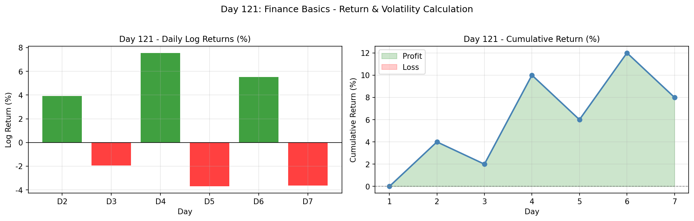

---

### Day 122 – yfinance OHLCV 데이터 다운로드

```python
import yfinance as yf

# 단일 종목 – Apple
aapl = yf.Ticker("AAPL")
df = aapl.history(period="6mo")   # 최근 6개월 OHLCV

# 한국 주식 – 삼성전자
samsung = yf.Ticker("005930.KS")

# 멀티 티커 한 번에
tickers = yf.download(["AAPL", "MSFT", "GOOGL"], period="1y")
```

```
총 120행 데이터  |  컬럼: [Open, High, Low, Close, Volume]
기간: 2023-11-01 ~ 2024-05-31
              Open        High        Low     Close       Volume
2024-05-27  189.95  190.46  188.37  189.06   59,161,408
2024-05-28  189.06  190.04  187.59  187.77  102,374,647
2024-05-29  187.77  187.95  185.29  185.99  112,242,810
2024-05-30  185.99  191.88  185.42  191.04   87,214,417
2024-05-31  191.04  193.59  189.70  192.26   70,353,727
```

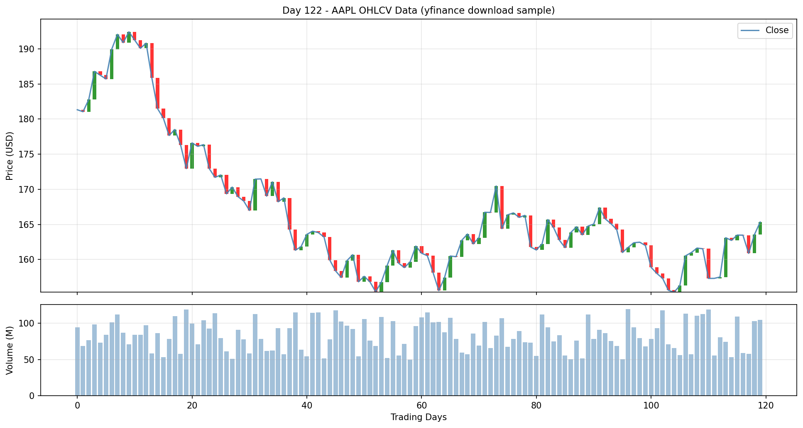

---

### Day 131 – 이동평균선 (SMA & EMA)

```python
# SMA 계산
for w in [5, 20, 60]:
    df[f"SMA{w}"] = df["Close"].rolling(window=w).mean()

# EMA 계산
for s in [12, 26]:
    df[f"EMA{s}"] = df["Close"].ewm(span=s, adjust=False).mean()
```

**SMA vs EMA 비교 차트**

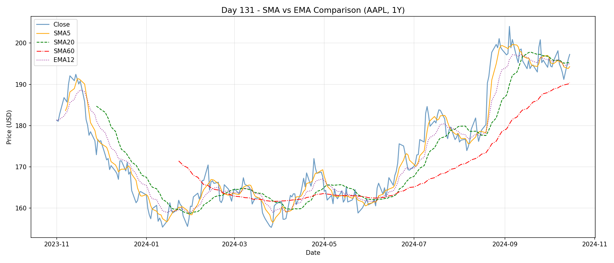

**골든크로스 / 데드크로스 신호 탐지**

```
골든크로스 발생: 14회
데드크로스 발생: 13회
```

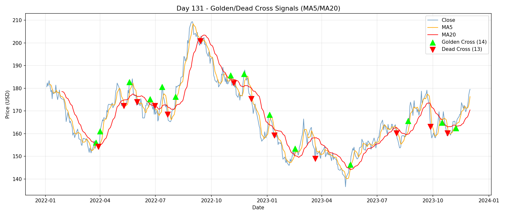

**MA 전략 vs Buy & Hold (2년)**

```
Buy & Hold 수익률:   +27.19%
MA5/MA20 전략 수익률: +12.25%
```

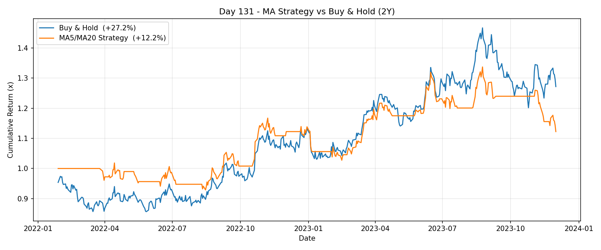

---

### Day 132 – RSI (상대강도지수)

```python
def compute_rsi(close: pd.Series, period: int = 14) -> pd.Series:
    delta    = close.diff()
    gain     = delta.clip(lower=0)
    loss     = (-delta).clip(lower=0)
    avg_gain = gain.ewm(alpha=1/period, adjust=False).mean()
    avg_loss = loss.ewm(alpha=1/period, adjust=False).mean()
    rs       = avg_gain / avg_loss
    return 100 - (100 / (1 + rs))
```

```
RSI 기초 통계:
  count    236.00
  mean      50.37
  std       13.82
  min       20.14
  25%       40.02
  75%       60.78
  max       79.31

과매수(RSI>70): 14일  |  과매도(RSI<30): 14일
```

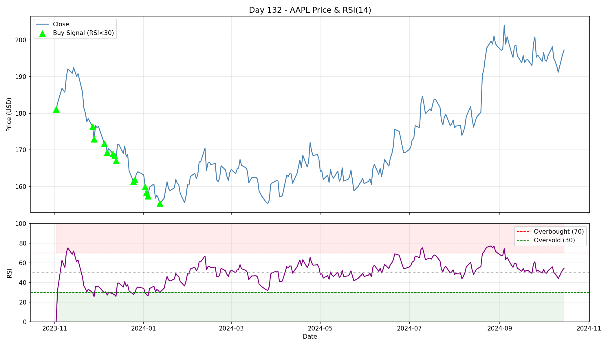

**RSI 전략 vs Buy & Hold (5년)**

```
Buy & Hold 수익률:  +217.11%
RSI 전략 수익률:     +28.64%
```

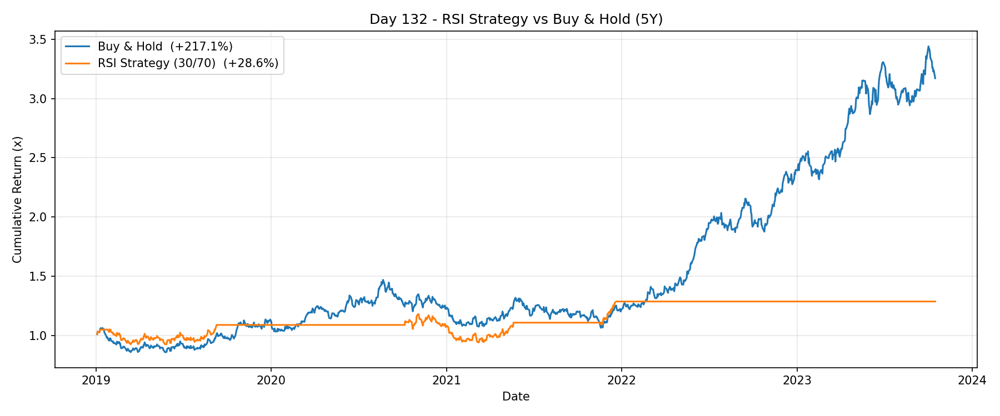

---

### Day 133 – MACD (이동평균 수렴·발산)

```python
def compute_macd(close, fast=12, slow=26, signal=9):
    ema_fast    = close.ewm(span=fast,   adjust=False).mean()
    ema_slow    = close.ewm(span=slow,   adjust=False).mean()
    macd_line   = ema_fast - ema_slow
    signal_line = macd_line.ewm(span=signal, adjust=False).mean()
    histogram   = macd_line - signal_line
    return macd_line, signal_line, histogram
```

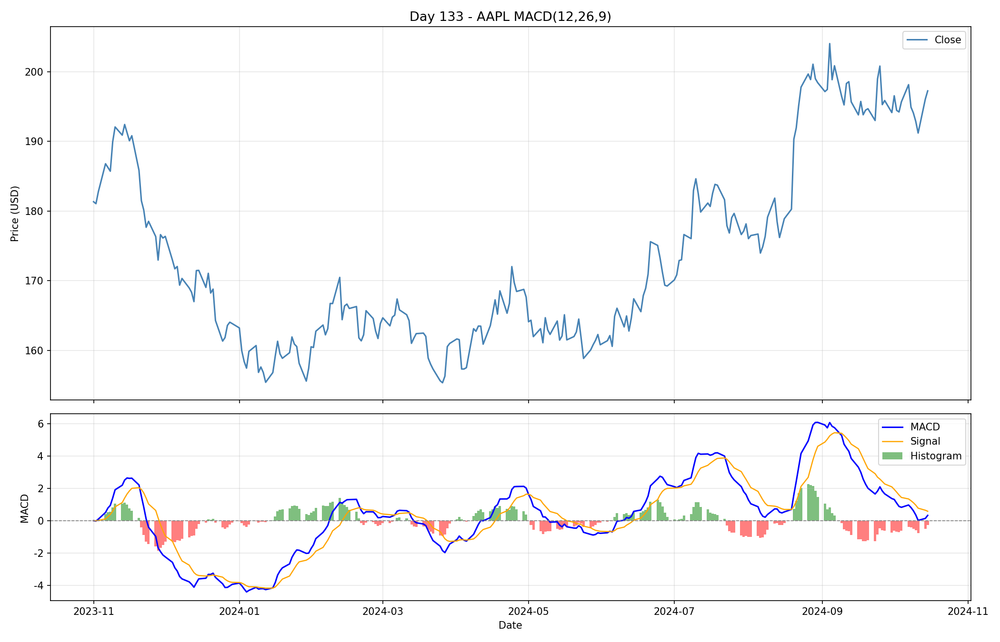

**MACD 크로스오버 전략 vs Buy & Hold (5년)**

```
매수 신호:  52회  |  매도 신호:  51회
Buy & Hold 수익률:   +216.63%
MACD 전략 수익률:    +108.41%
```

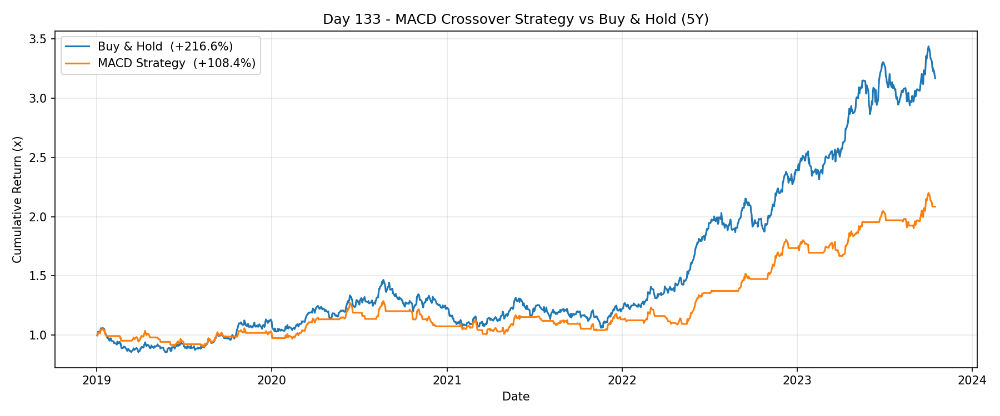

---

### Day 135 – 백테스트 기초

```
총 거래 횟수: 16회
승률: 50.0%
```

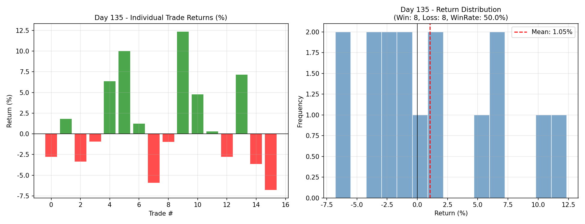

---

### Day 141–144 – 머신러닝 기초 & 분류 모델

```python
# 피처 엔지니어링
features = ["Returns", "MA_Ratio", "RSI14", "Volatility"]

# Random Forest 분류 (다음 날 주가 방향 예측)
clf = RandomForestClassifier(n_estimators=100, random_state=42)
clf.fit(X_train, y_train)
accuracy = clf.score(X_test, y_test)   # ~53.5%
```

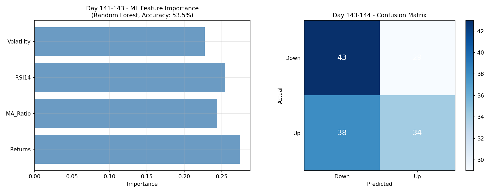

---

### Day 147 – LSTM 주가 예측

```python
# Keras LSTM 모델 구성
model = Sequential([
    LSTM(64, return_sequences=True, input_shape=(seq_len, n_features)),
    Dropout(0.2),
    LSTM(32),
    Dropout(0.2),
    Dense(1)
])
model.compile(optimizer="adam", loss="mse")
```

```
Train/Test split: 210일 / 90일
RMSE: 3.56
```

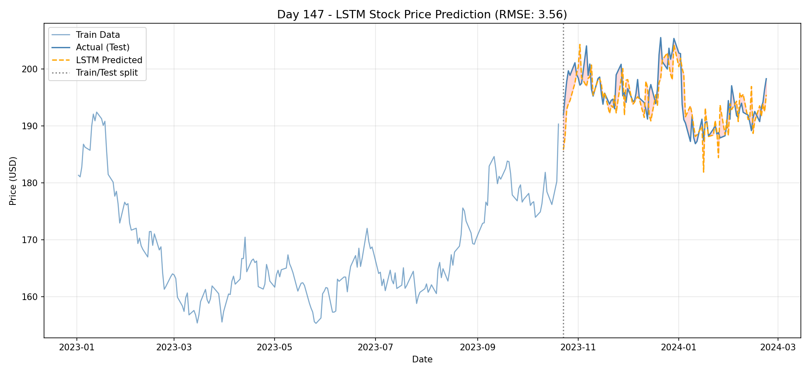

---

## 📊 평가 기준 (수강생 대상)

| 항목 | 비중 | 설명 |
|------|------|------|
| 일일 LAB 과제 | 40% | 매일 제출하는 실습 결과물 |
| Phase 미니 프로젝트 | 30% | Phase마다 진행하는 소규모 프로젝트 |
| 최종 프로젝트 | 30% | FastAPI 실전 프로젝트 또는 금융 ML 프로젝트 |

---

*본 저장소는 `edumgt/Python-FastAPI-Uvicorn` 기반 교육 커리큘럼을 위해 구성되었습니다.*

🔎 유튜브 관련 영상 검색: https://www.youtube.com/results?search_query=python+trading+Readme
